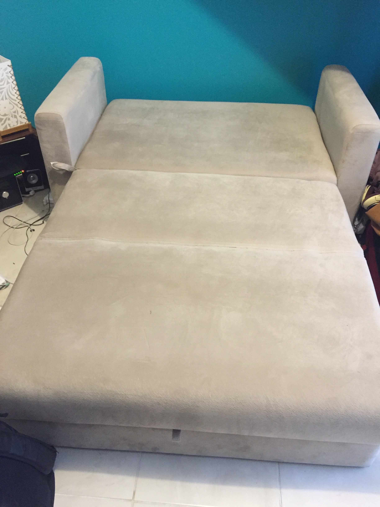
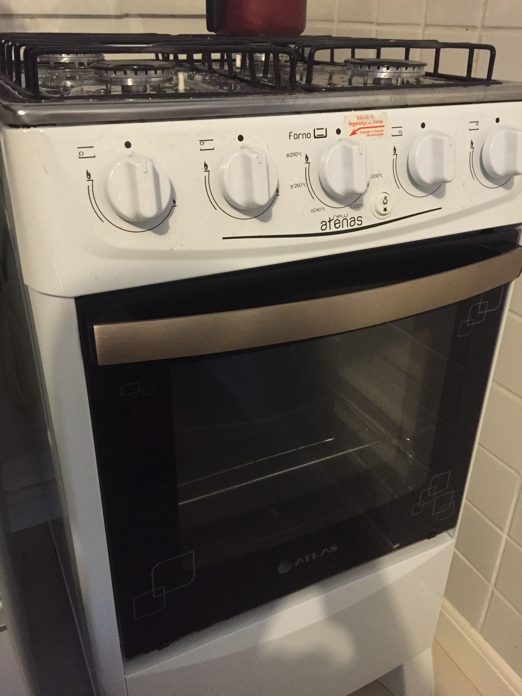
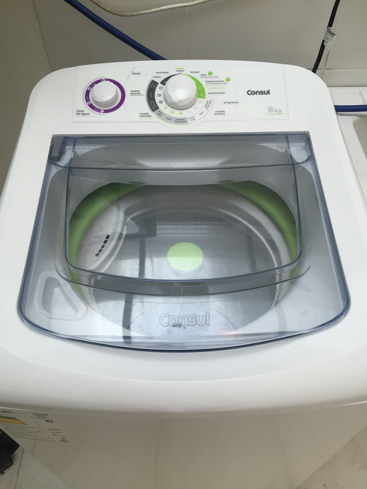
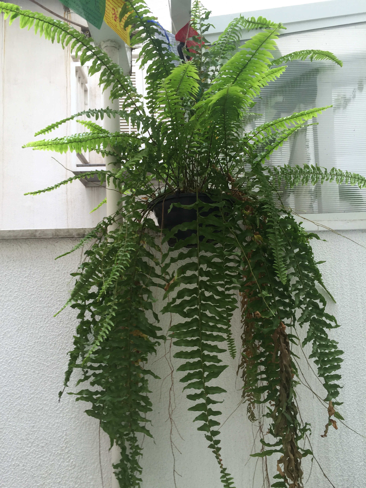
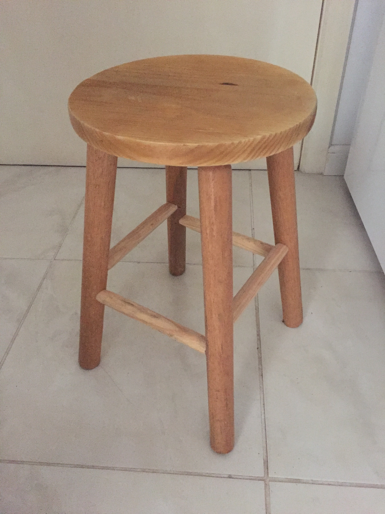

# Torra tudo!!!

Anike vende, aluga e doa tudo que você sempre buscou!

---

Os móveis

## a venda!

----

O sofá - R$500

----

<strike>A cama - R$800</strike> VENDIDA!

----

O fogão - R$400

----

A máquina de lavar roupa - R$800

---

Os móveis sendo

## doados!

----

<strike>As plantas</strike> DOADAS!

----

<strike>A estante</strike> DOADA!

----

<strike>A mesinha</strike> DOADA!

----

As cadeiras de praia

----

<strike>Os (4) banquinhos</strike> DOADOS!

---

As decorações sendo

## doadas!

----

A felicidade, os cestinhos e os porta-copos

----

O abajur e a caixa de costura (com o kit dentro!)

----

O quadro e a vela

---

O apartamento sendo

## alugado!

----

## Localidade
* Na Cidade Baixa - perto da boemia
* Na Sofia Veloso - longe do barulho
* Entre Redenção e Centro - perto de transporte
* Entre Republica e Lima - longe dos coxinhas ;)

----

A cozinha

----

## Ambiente
* Dois andares, com patio externo
* Cozinha com balcão
* Inclui geladeira, microondas, split

----

Mais fotos por vir!!

----

## Preços
* Aluguel: R$1,400
* Condominio: ~R$250
* IPTU: ~R$50

---

## Perguntas? Sugestões?

Contata essa pessoa aqui!

aarni@thoughtworks.com

